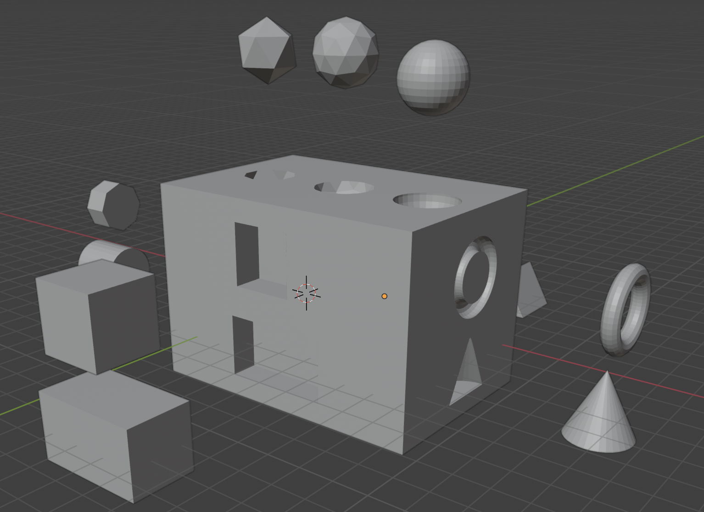
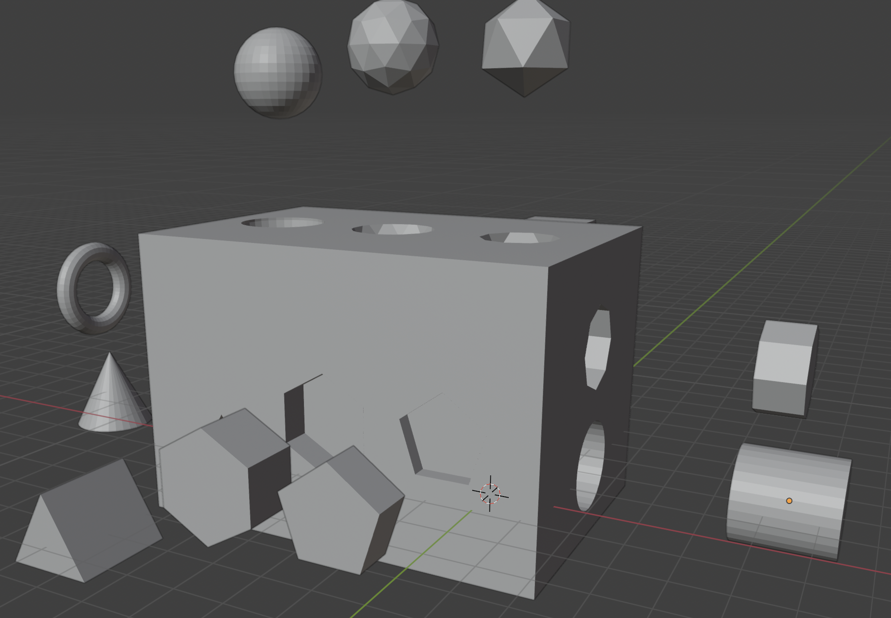
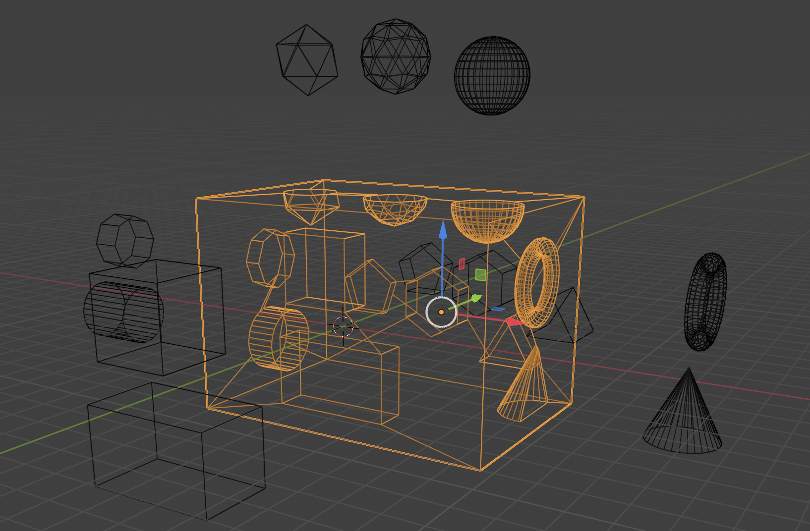
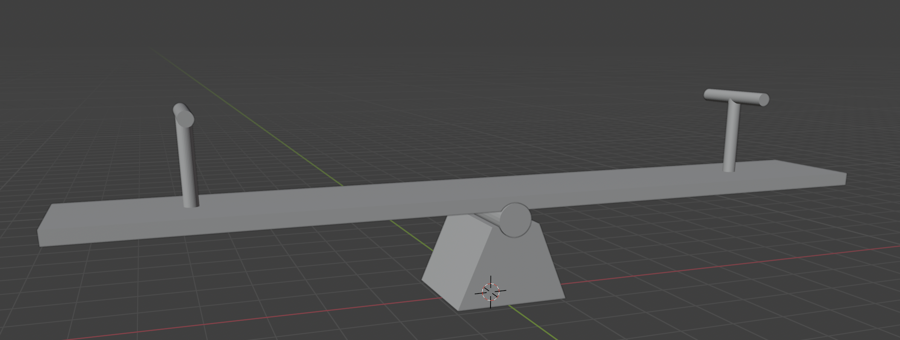

# Atividade Prática de Modelagem 3d.

## Descrição atividade
1- Realize a modelagem tridimensional de um campo de futebol
	- Gramado precisa de um design;
	- Necessário ter bandeirinha;
	- Cabine do Var;
	- Ter as traves do gol

2- Construa um cubo de caixa educativo
	- No minimo 12 formas;
	- Fazer o recorte;
	- E manter as peças.

3- Construa e anime uma gangorra

### Campo de Futebol

 

### Caixa Educativa

 

### Gangorra

[GangorraVideo](imgs/Gangorra/GangorraVídeo.mp4)